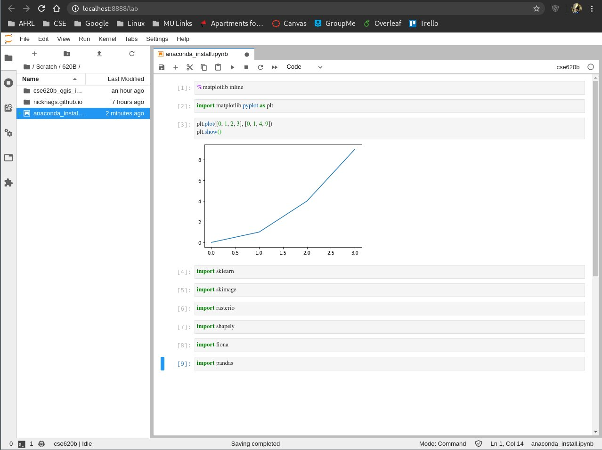

## Nick Hagerty - CSE 620B - Remote Sensing and Computer Vision - Installing Anaconda

This page summarizes the process of installing Anaconda Python (python3), then creating an environment, an ipython kernel, and running jupyter-lab/

### Preliminaries

This blog post details commands and concepts from a Linux-based Operating System in a Bash shell. Some changes will be necessary to use these commands on Windows systems.

### Commands
```
# Install Anaconda - shell script downloaded from Anaconda website
bash 'Anaconda-install-script.sh'
# Start a fresh terminal after installing Anaconda
# Create CSE620B environment
conda create -n cse620b python=3.7
# Activate and switch to CSE620B environment
conda activate cse620b
# Install necessary packages
conda install scipy ipython matplotlib  jupyterlab scikit-learn scikit-image opencv rasterio shapely fiona ipykernel pandas nodejs
# Install ipykernel with CSE620B environment recognized
python -m ipykernel install --user --name cse620b
# Start jupter lab session (should open a browser window)
jupyter-lab
```

### Testing Jupyter-lab Installation

Below is a screenshot of a jupyter-lab window testing the installation from this post.



Successful 'import' commands produce no output (as shown).

### Support or Contact

Having trouble with Pages? Check out our [documentation](https://docs.github.com/categories/github-pages-basics/) or [contact support](https://github.com/contact) and we’ll help you sort it out.
